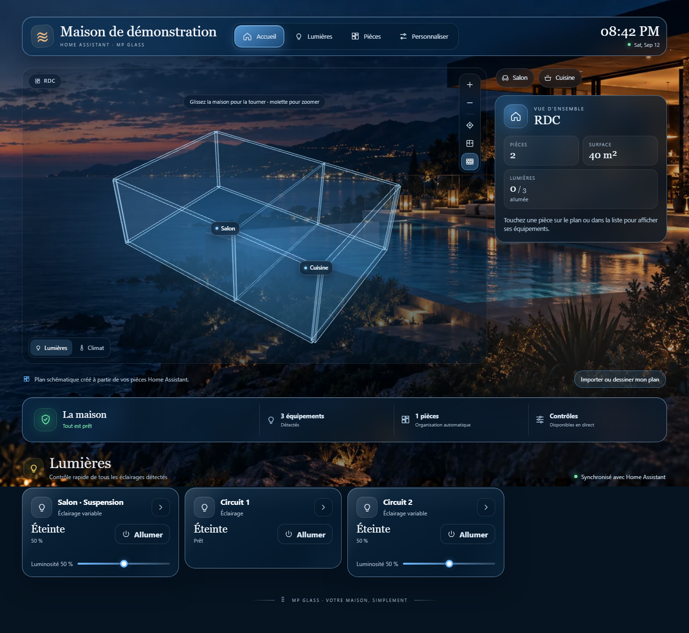

# MP Glass

**Install. Discover. Personalize. Deploy.**

Framework de dashboards Home Assistant : configurer une installation, puis déduire son interface à partir des pièces, des appareils et de leurs capacités.

**État : version de développement 0.6.0, installable depuis HACS comme dépôt personnalisé.** Le parcours lumière et le Studio ont été validés sur HA 2026.9.1. Le plan 3D et l’import Gemini sont testés localement ; l’appel Gemini réel reste à valider.



Cette image montre une fixture de développement, pas une maison cliente. [Résultats et limites des tests](docs/VALIDATION.md).

## Contenu actuel

- Backend Home Assistant : Config Flow, Options Flow, stockage projet validé, API authentifiée et diagnostics limités aux compteurs.
- Core TypeScript indépendant : normalisation, capacités lumière, classification explicable, overrides, registre de cartes et composition déterministe.
- Frontend : stratégie MP Glass Dashboard, vue responsive, carte lumière marche/arrêt et luminosité, fallback, editor, panneau de découverte et apparence.
- Six presets : Glass Blue, Warm, Dark, Light, OLED et Neutral. La direction photographique premium et le wizard complet restent au programme.
- [MP Spatial](docs/FLOORPLAN.md) : plan 3D manipulable, pièces/niveaux, états et lumières associés. [Gemini direct, sans add-on](docs/GEMINI_QUICKSTART.md) : une clé API dans MP Glass suffit pour importer PDF/images en brouillons corrigibles. Le worker séparé reste une option avancée.

## Installer et créer un premier dashboard

**Avec HACS (recommandé, mises à jour depuis l’interface) :** HACS → menu ⋮ → **Dépôts personnalisés** → `https://github.com/Micpi/mp-glass`, type **Intégration** → Ajouter. Rechercher **MP Glass**, **Télécharger**, puis redémarrer Home Assistant et ajouter l’intégration MP Glass. En ouvrant **MP Glass Studio**, le dashboard **MP Glass** est créé dans la barre latérale. Les versions suivantes apparaissent ensuite dans **Paramètres → Mises à jour**.

Voir [INSTALL](docs/INSTALL.md) et [QUICKSTART](docs/QUICKSTART.md). Minimum cible HA 2026.6 ; instance de développement épinglée sur 2026.9.1. Il ne s'agit pas encore d'une compatibilité certifiée.

Après installation et redémarrage HA : ajouter l'intégration MP Glass, ouvrir MP Glass Studio (qui crée le dashboard MP Glass), analyser, enregistrer. Le module est fourni avec l'intégration. Aucun YAML chantier n'est nécessaire pour ce parcours.

## Développement

```sh
npm install
npm run dev
npm test
npm run build
npm run test:e2e
```

`npm run dev` ouvre une fixture locale. Pour un vrai serveur HA isolé : `pwsh -File scripts/dev-ha.ps1` avec Docker Engine actif. Ne pas confondre ces deux environnements.

## Documentation

[Architecture](ARCHITECTURE.md) · [Home Graph](DATA_MODEL.md) · [Capabilities](CAPABILITY_MODEL.md) · [Projet](PROJECT_CONFIG.md) · [Roadmap](ROADMAP.md) · [ADR](docs/adr/) · [Cards](docs/CARDS.md) · [Découverte](docs/DISCOVERY.md) · [Intégrateur](docs/INTEGRATOR.md) · [Sécurité](docs/SECURITY.md) · [Développement](docs/DEVELOPMENT.md).

Climate → Cover → TV/Remote, mobilier et ouvertures 3D, catalogue complet, templates, hybrid mode et draft/publish restent dans la roadmap. `npm run dev` puis `/?spatial` affiche un exemple fictif du plan 3D.
